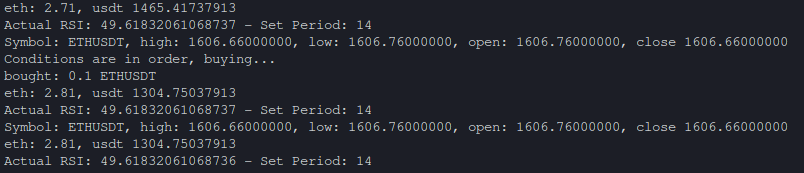

# Apathetic Trading Bot

Apathetic Trading Bot is an original cryptocurrency trading bot written in Rust. This bot uses the Binance API to perform basic trading operations based on a predefined trading strategy.



## Technical Overview

- **Language**: Rust
- **Dependencies**: Binance API, tokio (asynchronous runtime), dotenv (environment variable management), and more.
- **Strategy**: Implements a Relative Strength Index (RSI) trading strategy.
- **Trading Pair**: ETH/USDT (Ethereum to US Dollar Tether).

The bot leverages the Binance WebSocket API to access real-time market data. It subscribes to the ETH/USDT trading pair and receives Kline (candlestick) data. This real-time data is used to calculate the RSI and make trading decisions.

## Usage

To run the bot, clone the GitHub repository, set up your Binance API credentials in a `.env` file, and execute it using Cargo:

```shell
cargo run
```

